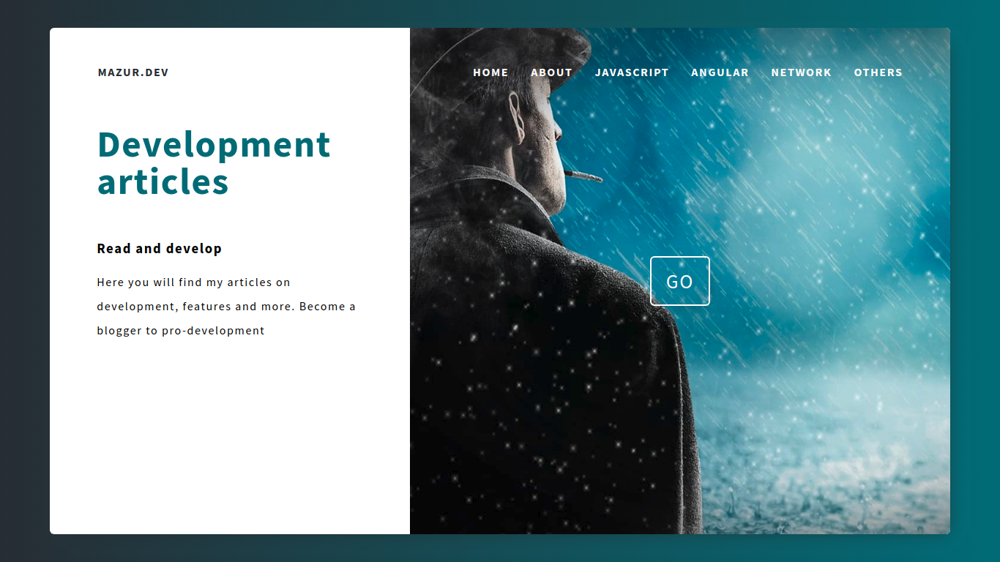

<p align="center">
  <a href="https://github.com/mazurdev/web-development-articles">
    
  </a>
  <h1 align="center">WEB DEVELOPMENT ARTICLES</h1>
  <p align="center">This is a preview-service for my articles</p>
  <p align="center">
   <a href="https://twitter.com/mazurdev"></a>
  </p>
  <br>
</p>

<sub>Check out my [blog-portfolio](https://mazurdev.com/)</sub>

## INTRO



## :wrench: STACK

* Vue.js
* SPA
* Server-side rendering

## :heavy_check_mark: Getting started
```bash
git clone https://github.com/mazurdev/web-development-articles.git
cd to folder
npm run serve | yarn serve
```

## Build
```bash
npm run build | yarn build
cd dist
http-servre -o
```